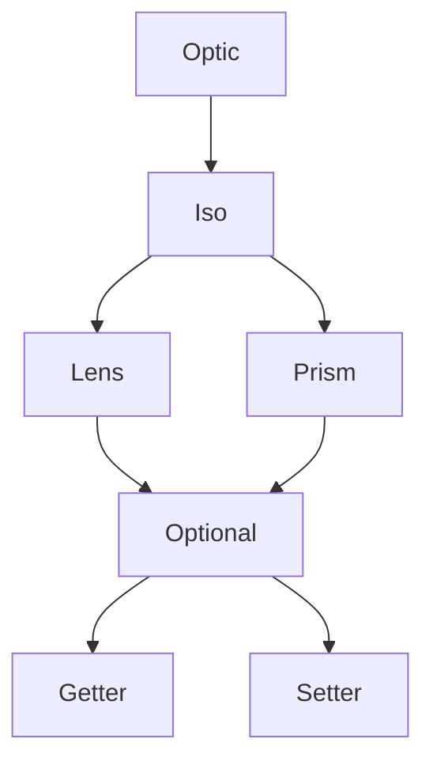

<h3 align="center">
  <a href="https://fp-ts.github.io/optic/">
    
  </a>
</h3>

<p align="center">
A porting of <a href="https://github.com/zio/zio-optics">zio-optics</a> to TypeScript
</p>

<p align="center">
  <a href="https://www.npmjs.com/package/@fp-ts/optic">
    
  </a>
</p>

# Features

- **Unified Representation Of Optics**. All optics compose the same way because they are all instances of the same data type (`Optic`)

# Optics



# Example

```ts
import * as O from "@fp-ts/data/Option";

interface Street {
  num: number;
  name: O.Option<string>;
}
interface Address {
  city: string;
  street: Street;
}
interface Company {
  name: string;
  address: Address;
}
interface Employee {
  name: string;
  company: Company;
}
```

Let's say we have an employee and we need to upper case the first character of his company street name.

```ts
const from: Employee = {
  name: "john",
  company: {
    name: "awesome inc",
    address: {
      city: "london",
      street: {
        num: 23,
        name: O.some("high street"),
      },
    },
  },
};

const to: Employee = {
  name: "john",
  company: {
    name: "awesome inc",
    address: {
      city: "london",
      street: {
        num: 23,
        name: O.some("High street"),
      },
    },
  },
};
```

Let's see what could we do with `@fp-ts/optic`

```ts
import * as Optic from "@fp-ts/optic";
import * as OptionOptic from "@fp-ts/optic/data/Option";
import * as StringOptic from "@fp-ts/optic/data/string";

const _name: Optic.Optional<Employee, string> = Optic.id<Employee>()
  .compose(Optic.key("company")) // Lens<Employee, Company>
  .compose(Optic.key("address")) // Lens<Employee, Company>
  .compose(Optic.key("street")) // Lens<<Employee, Company>
  .compose(Optic.key("name")) // Lens<Street, O.Option<string>>
  .compose(OptionOptic.some()) // Prism<O.Option<string>, string>
  .compose(StringOptic.index(0)); // Optional<string, string>

const capitalize = (s: string): string => s.toUpperCase();

const capitalizeName = Optic.modify(_name)(capitalize);

expect(capitalizeName(from)).toEqual(to);
```

# Installation

To install the **alpha** version:

```
npm install @fp-ts/optic
```

# Documentation

- [API Reference](https://fp-ts.github.io/optic/)

# License

The MIT License (MIT)
