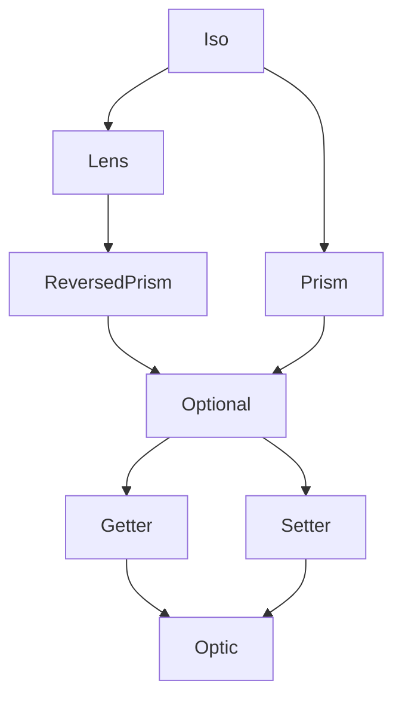

<h3 align="center">
  <a href="https://fp-ts.github.io/optic/">
    
  </a>
</h3>

<p align="center">
A porting of <a href="https://github.com/zio/zio-optics">zio-optics</a> to TypeScript
</p>

<p align="center">
  <a href="https://www.npmjs.com/package/@fp-ts/optic">
    
  </a>
</p>



# Features

- **Unified Representation Of Optics**. All optics compose the same way because they are all instances of the same data type (`Optic`)
- **Integration**. Built-in optics for `@fp-ts/data` data structures, like `Option`, `Either` and `Chunk`

## Introduction

`@fp-ts/optic` is a library that makes it easy to modify parts of larger data structures based on a single representation of an optic as a combination of a getter and setter.

`@fp-ts/optic` features a unified representation of optics, deep `@fp-ts/data` integration, helpful error messages,

## Requirements

- TypeScript 4.7 or newer
- The `strict` flag enabled in your `tsconfig.json` file

## Getting started

To get started with `@fp-ts/optic`, you will need to install the library (**alpha** version) using npm or yarn:

```
npm install @fp-ts/optic
```

```
yarn add @fp-ts/optic
```

Once you have installed the library, you can import the necessary types and functions from the `@fp-ts/optic` module.

```ts
import * as Optic from "@fp-ts/optic";
```

# Summary

Let's say we have an employee and we need to upper case the first character of his company street name.

```ts
import * as O from "@fp-ts/data/Option";

interface Street {
  readonly num: number;
  readonly name: O.Option<string>;
}
interface Address {
  readonly city: string;
  readonly street: Street;
}
interface Company {
  readonly name: string;
  readonly address: Address;
}
interface Employee {
  readonly name: string;
  readonly company: Company;
}

const from: Employee = {
  name: "john",
  company: {
    name: "awesome inc",
    address: {
      city: "london",
      street: {
        num: 23,
        name: O.some("high street"),
      },
    },
  },
};

const to: Employee = {
  name: "john",
  company: {
    name: "awesome inc",
    address: {
      city: "london",
      street: {
        num: 23,
        name: O.some("High street"),
      },
    },
  },
};
```

Let's see what could we do with `@fp-ts/optic`

```ts
import * as Optic from "@fp-ts/optic";
import * as StringOptic from "@fp-ts/optic/data/String";
import * as String from "@fp-ts/data/String";

const _firstChar: Optic.Optional<Employee, string> = Optic.id<Employee>()
  .at("company")
  .at("address")
  .at("street")
  .at("name")
  .some()
  .compose(StringOptic.index(0));

const capitalizeName = Optic.modify(_firstChar)(String.toUpperCase);

expect(capitalizeName(from)).toEqual(to);
```

# Understanding Optics

`@fp-ts/optic` is based on a single representation of an optic as a combination of a getter and a setter.

```ts
export interface Optic<
  in GetWhole,
  in SetWholeBefore,
  in SetPiece,
  out GetError,
  out SetError,
  out GetPiece,
  out SetWholeAfter
> {
  readonly getOptic: (
    GetWhole: GetWhole
  ) => Either<readonly [GetError, SetWholeAfter], GetPiece>;
  readonly setOptic: (
    SetPiece: SetPiece
  ) => (
    SetWholeBefore: SetWholeBefore
  ) => Either<readonly [SetError, SetWholeAfter], SetWholeAfter>;
}
```

The getter can take some larger structure of type `GetWhole` and get a part of it of type `GetPiece`. It can potentially fail with an error of type `GetError` because the part we are trying to get might not exist in the larger structure.

The setter has the ability, given some piece of type `SetPiece` and an original structure of type `SetWholeBefore`, to return a new structure of type `SetWholeAfter`. Setting can fail with an error of type `SetError` because the piece we are trying to set might not exist in the structure.

## Lens

A `Lens` is an optic that accesses a field of a product type, such as a tuple or a struct.

The `GetError` type of a `Lens` is `never` because we can always get a field of a product type. The `SetError` type is also `never` because we can always set the field of a product type to a new value.

In this case the `GetWhole`, `SetWholeBefore`, and `SetWholeAfter` types are the same and represent the product type. The `GetPiece` and `SetPiece` types are also the same and represent the field.

Thus, we have:

```ts
export interface Lens<in out S, in out A>
  extends Optic<S, S, A, never, never, A, S> {}
```

The simplified signature is:

```ts
export interface Lens<in out S, in out A> {
  readonly getOptic: (s: S) => Either<never, A>;
  readonly setOptic: (a: A) => (s: S) => Either<never, S>;
}
```

This conforms exactly to our description above. A lens is an optic where we can always get part of the larger structure and given an original structure we can always set a new value in that structure.

## Prism

A `Prism` is an optic that accesses a case of a sum type, such as the `Left` or `Right` cases of an `Either`.

Getting part of a larger data structure with a prism can fail because the case we are trying to access might not exist. For example, we might be trying to access the right side of an `Either` but the either is actually a `Left`.

We use the data type `Error` to model the different ways that getting or setting with an optic can fail. So the `GetError` type of a prism will be `Error`.

The `SetError` type of a prism will be `never` because given one of the cases of a product type we can always return a new value of the product type since each case of the product type is an instance of the product type.

A prism also differs from a lens in that we do not need any original structure to set. A product type consists of nothing but its cases so if we have a new value of the case we want to set we can just use that value and don't need the original structure.

We represent this by using `unknown` for the `SetWholeBefore` type, indicating that we do not need any original structure to set a new value.

Thus, the definition of a prism is:

```ts
export interface Prism<in out S, in out A>
  extends Optic<S, unknown, A, Error, never, A, S> {}
```

And the simplified signature is:

```ts
export interface Prism<in out S, in out A> {
  readonly getOptic: (s: S) => Either<Error, A>;
  readonly setOptic: (a: A) => (s: unknown) => Either<never, S>;
}
```

Again this conforms exactly to our description. A prism is an optic where we might not be able to get a value but can always set a value and in fact do not require any original structure to set.

## Other

`@fp-ts/optic` supports a wide variety of other optics:

- **Optional**. An `Optional` is an optic that accesses part of a larger structure where the part being accessed may not exist and the structure contains more than just that part. Both the `GetError` and `SetError` types are `Error` because the part may not exist in the structure and setting does require the original structure since it consists of more than just this one part.
- **Iso**. An `Iso` is an optic that accesses a part of a structure where the structure consists of nothing but the part. Both the `GetError` and `SetError` types are `never` and the `SetWholeBefore` type is `unknown`.
- **Getter**. A `Getter` is an optic that only allows getting a value. The `SetWholeBefore` and `SetPiece` types are `never` because it is impossible to ever set.
- **Setter**. A `Setter` is an optic that only allows setting a value. The `GetWhole` type is `never` because it is impossible to ever get.

There are also more polymorphic versions of each optic that allow the types of the data structure and part before and after to differ. For example, a `PolyPrism` could allow us to access the right case of an `Either<A, B>` and set a `C` value to return an `Either<A, C>`.

# Cheatsheet

## Optic constructors

| Optic    | Name         | Given                                                           | To                         |
| -------- | ------------ | --------------------------------------------------------------- | -------------------------- |
| Iso      | iso          | `S => A`, `A => S`                                              | `Iso<S, A>`                |
|          | id           |                                                                 | `Iso<S, S>`                |
| Lens     | lens         | `S => A`, `A => S => S`                                         | `Lens<S, A>`               |
|          | at           | `Key`                                                           | `Lens<S, S[Key]>`          |
|          | pick         | `Key`                                                           | `Lens<S, Pick<S, Key>>`    |
|          | omit         | `Key`                                                           | `Lens<S, Omit<S, Key>>`    |
| Prism    | prism        | `S => Either<Error, A>`, `A => S`                               | `Prism<S, A>`              |
|          | polyPrism    | `S => Either<[Error, T], A>`, `B => T`                          | `PolyPrism<S, T, A, B>`    |
|          | cons         |                                                                 | `Prism<A[], [A, A[]]>`     |
|          | nonNullable  |                                                                 | `Prism<A, NonNullable<A>>` |
|          | some         |                                                                 | `Prism<Option<A>, A>`      |
|          | filter       | `Predicate<S>`                                                  | `Prism<S, S>`              |
|          | filter       | `Refinement<S, A>`                                              | `Prism<S, A>`              |
| Optional | optional     | `S => Either<Error, A>`, `A => S => Either<Error, S>`           | `Optional<S, A>`           |
|          | polyOptional | `S => Either<[Error, T], A>`, `B => S => Either<[Error, T], T>` | `PolyOptional<S, T, A, B>` |
|          | index        | `number`                                                        | `Optional<A[], A>`         |
|          | key          | `string`                                                        | `Optional<{ []: A }, A>`   |
|          | head         |                                                                 | `Optional<A[], A>`         |
|          | tail         |                                                                 | `Optional<A[], A[]>`       |
|          | findFirst    | `Predicate<A>`                                                  | `Optional<A[], A>`         |
|          | findFirst    | `Refinement<A, B>`                                              | `Optional<A[], B>`         |

## Getter / Setter APIs

| Name          | Given                           | To                 |
| ------------- | ------------------------------- | ------------------ |
| get           | `Lens<S, A>`, `S`               | `A`                |
| decode        | `Prism<S, A>`, `S`              | `Either<Error, A>` |
| encode        | `Prism<S, A>`, `A`              | `S`                |
| getOrModify   | `PolyOptional<S, T, A, B>`, `S` | `Either<T, A>`     |
| modify        | `Optional<S, A>`, `A => A`      | `S => S`           |
| replace       | `Setter<S, A>`, `A`, `S`        | `S`                |
| replaceOption | `Setter<S, A>`, `A`, `S`        | `Option<S>`        |
| getOption     | `Getter<S, A>`, `S`             | `Option<A>`        |

# Basic usage

## id

The `id` optic is a special optic that represents the identity function, which simply returns its input unchanged. It can be thought of as a "base case" for optics, from which more complex optics can be built.

The `id` optic is defined as a singleton type, meaning that there is only one possible value for it. This makes it easy to use as a starting point for building larger optics, as it does not require any arguments or configuration.

```ts
import * as Optic from "@fp-ts/optic";

interface Whole {
  readonly a: string;
  readonly b: number;
  readonly c: boolean;
}

// create an iso that focuses on the 'Whole' data structure
const _a: Optic.Iso<Whole, Whole> = Optic.id<Whole>();
```

## compose

The `compose` method is a utility function that allows you to combine two or more optics into a single optic.

```ts
import { pipe } from "@fp-ts/data/Function";
import * as Optic from "@fp-ts/optic";

// This is the type of the data structure that the lens will be operating on.
interface Whole {
  readonly a: string;
  readonly b: number;
  readonly c: boolean;
}

// This creates a lens that focuses on the 'a' field within the 'Whole' object.
const _a: Optic.Lens<Whole, string> =
  // The 'id' function creates an identity lens for the 'Whole' type.
  Optic.id<Whole>()
    // The 'compose' method combines the identity lens with an 'at' lens,
    // which selects the 'a' field within the 'Whole' object.
    .compose(Optic.at("a"));

// Now we can use the '_a' lens to view and modify the 'a' field of a 'Whole' object.

const whole: Whole = {
  a: "foo",
  b: 42,
  c: true,
};

// Use the 'get' function to view the 'a' field of the 'whole' object.
const result: string = pipe(whole, Optic.get(_a)); // returns "foo"

// Use the 'replace' function to update the 'a' field of the 'whole' object.
const updated: Whole = pipe(whole, Optic.replace(_a)("bar")); // returns { a: "bar", b: 42, c: true }
```

## at

The `at` method is a utility function that creates an optic that focuses on a specific field within a data structure.

```ts
import { pipe } from "@fp-ts/data/Function";
import * as Optic from "@fp-ts/optic";

// This is the type of the data structure that the lens will be operating on.
interface Whole {
  readonly a: string;
  readonly b: number;
  readonly c: boolean;
}

// This creates a lens that focuses on the 'a' field within the 'Whole' object.
const _a: Optic.Lens<Whole, string> =
  // The 'id' function creates an identity lens for the 'Whole' type.
  Optic.id<Whole>()
    // The 'at' method selects the 'a' key within the 'Whole' object,
    // resulting in a lens that is focused on that field.
    .at("a");

// Now we can use the '_a' lens to view and modify the 'a' field of a 'Whole' object.

const whole: Whole = {
  a: "foo",
  b: 42,
  c: true,
};

// Use the 'get' function to view the 'a' field of the 'whole' object.
const result: string = pipe(whole, Optic.get(_a)); // returns "foo"

// Use the 'replace' function to update the 'a' field of the 'whole' object.
const updated: Whole = pipe(whole, Optic.replace(_a)("bar")); // returns { a: "bar", b: 42, c: true }
```

## pick

The `pick` method is a utility function that creates an optic that focuses on a group of keys within a data structure.

```ts
import { pipe } from "@fp-ts/data/Function";
import * as Optic from "@fp-ts/optic";

// This is the type of the data structure that the lens will be operating on.
interface Whole {
  readonly a: string;
  readonly b: number;
  readonly c: boolean;
}

// This creates a lens that focuses on the 'a' and 'b' fields within the 'Whole' object.
const _ab: Optic.Lens<Whole, { readonly a: string; readonly b: number }> =
  // The 'id' function creates an identity lens for the 'Whole' type.
  Optic.id<Whole>()
    // The 'pick' method selects the 'a' and 'b' keys within the 'Whole' object,
    // resulting in a lens that is focused on those fields.
    .pick("a", "b");

// Now we can use the '_ab' lens to view and modify the 'a' and 'b' fields of a 'Whole' object.

const whole: Whole = {
  a: "foo",
  b: 42,
  c: true,
};

// Use the 'get' function to view the 'a' and 'b' fields of the 'whole' object.
const result: { readonly a: string; readonly b: number } = pipe(
  whole,
  Optic.get(_ab)
); // returns { a: "foo", b: 42 }

// Use the 'replace' function to update the 'a' and 'b' fields of the 'whole' object.
const updated: Whole = pipe(whole, Optic.replace(_ab)({ a: "bar", b: 23 })); // returns { a: "bar", b: 23, c: true }
```

## omit

The `omit` method is a utility function that creates a lens that excludes a group of keys from a struct. This can be useful when you want to focus on a subset of a data structure and ignore certain fields.

```ts
import { pipe } from "@fp-ts/data/Function";
import * as Optic from "@fp-ts/optic";

interface Whole {
  readonly a: string;
  readonly b: number;
  readonly c: boolean;
}

// This creates a lens that focuses on the 'a' and 'c' fields within the 'Whole' object.
const _ac: Optic.Lens<Whole, { readonly a: string; readonly c: boolean }> =
  // The 'id' function creates an identity lens for the 'Whole' type.
  Optic.id<Whole>()
    // The 'omit' method excludes the 'b' key within the 'Whole' object,
    // resulting in a lens that is focused on the 'a' and 'c' fields.
    .omit("b");

// Now we can use the '_ac' lens to view and modify the 'a' and 'c' fields of a 'Whole' object.

const whole: Whole = {
  a: "foo",
  b: 42,
  c: true,
};

// Use the 'get' function to view the 'a' and 'c' fields of the 'whole' object.
const result: { readonly a: string; readonly c: boolean } = pipe(
  whole,
  Optic.get(_ac)
); // returns { a: "foo", c: true }

// Use the 'replace' function to update the 'a' and 'c' fields of the 'whole' object.
const updated: Whole = pipe(whole, Optic.replace(_ac)({ a: "bar", c: false })); // returns { a: "bar", b: 42, c: false }
```

## filter

The `filter` method is a utility function that creates an optic that focuses on the elements of a data structure that match a specified predicate.

```ts
import { pipe } from "@fp-ts/data/Function";
import * as Optic from "@fp-ts/optic";
import type { Option } from "@fp-ts/data/Option";

// This is the type of the data structure that the prism will be operating on.
interface Whole {
  readonly a: number;
}

// This creates an `Optional` that focuses on the 'a' field within the 'Whole' object,
// and only includes values that are even numbers.
const _evenA: Optic.Optional<Whole, number> =
  // The 'id' function creates an identity prism for the 'Whole' type.
  Optic.id<Whole>()
    // The 'at' method selects the 'a' key within the 'Whole' object,
    // resulting in a `Lens` that is focused on that field.
    .at("a")
    // The 'filter' method only includes values that are even numbers.
    .filter((a) => a % 2 === 0);

// Now we can use the '_evenA' `Optional` to view and modify the 'a' field of a 'Whole' object,
// but only if the value is an even number.

const whole: Whole = {
  a: 2,
};

// Use the 'getOption' function to view the 'a' field of the 'whole' object.
const result: Option<number> = pipe(whole, Optic.getOption(_evenA)); // returns some(2)

// Use the 'replace' function to update the 'a' field of the 'whole' object.
const updated: Whole = pipe(whole, Optic.replace(_evenA)(4)); // returns { a: 4 }
```

## nonNullable

The `nonNullable` method is a utility function that creates a `Prism` that focuses on the non-nullable values of a nullable type. This is useful when you want to manipulate or extract the value of a nullable type, but want to ignore the `null` values.

```ts
import { pipe } from "@fp-ts/data/Function";
import * as Optic from "@fp-ts/optic";
import type { Option } from "@fp-ts/data/Option";

const _nonNullString: Optic.Prism<string | null, string> = Optic.id<
  string | null
>().nonNullable();

const result1: Option<string> = pipe("foo", Optic.getOption(_nonNullString)); // returns some("foo")
const result2: Option<string> = pipe(null, Optic.getOption(_nonNullString)); // returns none
```

## some

The `some` method is a utility function that creates an optic that focuses on the `Some` case of an `Option` data type. This optic allows you to view and modify the value contained within the `Some` case of an `Option`.

```ts
import { pipe } from "@fp-ts/data/Function";
import * as O from "@fp-ts/data/Option";
import * as Optic from "@fp-ts/optic";

// This creates a prism that focuses on the 'Some' case of the 'Option<number>' object.
const _some: Optic.Prism<O.Option<number>, number> = Optic.id<
  O.Option<number>
>().some();

const option: O.Option<number> = O.some(42);

const result: O.Option<number> = pipe(option, Optic.getOption(_some)); // returns some(42)

const updated: O.Option<number> = pipe(option, Optic.replace(_some)(23)); // returns some(23)
```

## index

The `index` method creates an `Optional` optic that focuses on a specific index in a `ReadonlyArray`. The `Optional` optic allows you to view the value at the specified index, or `None` if the index does not exist. You can also use the `Optional` optic to update the value at the specified index, if it exists.

```ts
import { pipe } from "@fp-ts/data/Function";
import * as Optic from "@fp-ts/optic";
import type { Option } from "@fp-ts/data/Option";

const _index2: Optic.Optional<ReadonlyArray<number>, number> = Optic.id<
  ReadonlyArray<number>
>().index(2);

const arr: ReadonlyArray<number> = [1, 2, 3, 4];

const result: Option<number> = pipe(arr, Optic.getOption(_index2)); // some(3)
const updated1: ReadonlyArray<number> = pipe(arr, Optic.replace(_index2)(42)); // [1, 2, 42, 4]
const updated2: ReadonlyArray<number> = pipe(arr, Optic.replace(_index2)(10)); // [1, 2, 10, 4]
const updated3: ReadonlyArray<number> = pipe([], Optic.replace(_index2)(10)); // []
```

## key

The `key` method is a utility function that allows you to create an `Optional` optic that focuses on a specific key of an index signature (a type with a string index signature).

```ts
import { pipe } from "@fp-ts/data/Function";
import type { Option } from "@fp-ts/data/Option";
import * as Optic from "@fp-ts/optic";

interface Data {
  readonly [key: string]: number;
}

// Create an Optional optic that focuses on the 'foo' key.
const _foo: Optic.Optional<Data, number> = Optic.id<Data>().key("foo");

const data: Data = {
  foo: 1,
  bar: 2,
};

// Use the 'getOption' function to view the value of the 'foo' key.
const fooValue: Option<number> = pipe(data, Optic.getOption(_foo)); // returns some(1)

// Use the 'replace' function to update the value of the 'foo' key.
const updatedData: Data = pipe(data, Optic.replace(_foo)(10)); // returns { foo: 10, bar: 2 }
```

# Documentation

- [API Reference](https://fp-ts.github.io/optic/)

# License

The MIT License (MIT)
