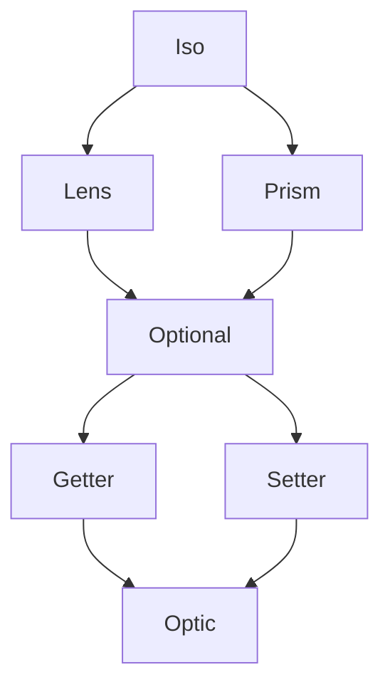

<h3 align="center">
  <a href="https://fp-ts.github.io/optic/">
    
  </a>
</h3>

<p align="center">
A porting of <a href="https://github.com/zio/zio-optics">zio-optics</a> to TypeScript
</p>

<p align="center">
  <a href="https://www.npmjs.com/package/@fp-ts/optic">
    
  </a>
</p>

`@fp-ts/optic` is a library that makes it easy to modify parts of larger data structures based on a single representation of an optic as a combination of a getter and setter.

`@fp-ts/optic` features a unified representation of optics, deep `@fp-ts/data` integration, helpful error messages,

# Features

- **Unified Representation Of Optics**. All optics compose the same way because they are all instances of the same data type (`Optic`)
- **Integration**. Built-in optics for `@fp-ts/data` data structures, like `List` and `Chunk`

# Optics



# Summary

Let's say we have an employee and we need to upper case the first character of his company street name.

```ts
import * as O from "@fp-ts/data/Option";

interface Street {
  num: number;
  name: O.Option<string>;
}
interface Address {
  city: string;
  street: Street;
}
interface Company {
  name: string;
  address: Address;
}
interface Employee {
  name: string;
  company: Company;
}

const from: Employee = {
  name: "john",
  company: {
    name: "awesome inc",
    address: {
      city: "london",
      street: {
        num: 23,
        name: O.some("high street"),
      },
    },
  },
};

const to: Employee = {
  name: "john",
  company: {
    name: "awesome inc",
    address: {
      city: "london",
      street: {
        num: 23,
        name: O.some("High street"),
      },
    },
  },
};
```

Let's see what could we do with `@fp-ts/optic`

```ts
import * as Optic from "@fp-ts/optic";
import * as StringOptic from "@fp-ts/optic/data/String";
import * as String from "@fp-ts/data/String";

const _firstChar: Optic.Optional<Employee, string> = Optic.id<Employee>()
  .at("company")
  .at("address")
  .at("street")
  .at("name")
  .some()
  .compose(StringOptic.index(0));

const capitalizeName = Optic.modify(_firstChar)(String.toUpperCase);

expect(capitalizeName(from)).toEqual(to);
```

# Understanding Optics

`@fp-ts/optic` is based on a single representation of an optic as a combination of a getter and a setter.

```ts
export interface Optic<
  in GetWhole,
  in SetWholeBefore,
  in SetPiece,
  out GetError,
  out SetError,
  out GetPiece,
  out SetWholeAfter
> {
  readonly getOptic: (
    GetWhole: GetWhole
  ) => Either<readonly [GetError, SetWholeAfter], GetPiece>;
  readonly setOptic: (
    SetPiece: SetPiece
  ) => (
    SetWholeBefore: SetWholeBefore
  ) => Either<readonly [SetError, SetWholeAfter], SetWholeAfter>;
}
```

The getter can take some larger structure of type `GetWhole` and get a part of it of type `GetPiece`. It can potentially fail with an error of type `GetError` because the part we are trying to get might not exist in the larger structure.

The setter has the ability, given some piece of type `SetPiece` and an original structure of type `SetWholeBefore`, to return a new structure of type `SetWholeAfter`. Setting can fail with an error of type `SetError` because the piece we are trying to set might not exist in the structure.

## Lens

A `Lens` is an optic that accesses a field of a product type, such as a tuple or a struct.

The `GetError` type of a `Lens` is `never` because we can always get a field of a product type. The `SetError` type is also `never` because we can always set the field of a product type to a new value.

In this case the `GetWhole`, `SetWholeBefore`, and `SetWholeAfter` types are the same and represent the product type. The `GetPiece` and `SetPiece` types are also the same and represent the field.

Thus, we have:

```ts
export interface Lens<in out S, in out A>
  extends Optic<S, S, A, never, never, A, S> {}
```

The simplified signature is:

```ts
export interface Lens<in out S, in out A> {
  readonly getOptic: (s: S) => Either<never, A>;
  readonly setOptic: (a: A) => (s: S) => Either<never, S>;
}
```

This conforms exactly to our description above. A lens is an optic where we can always get part of the larger structure and given an original structure we can always set a new value in that structure.

## Prism

A `Prism` is an optic that accesses a case of a sum type, such as the `Left` or `Right` cases of an `Either`.

Getting part of a larger data structure with a prism can fail because the case we are trying to access might not exist. For example, we might be trying to access the right side of an `Either` but the either is actually a `Left`.

We use the data type `Error` to model the different ways that getting or setting with an optic can fail. So the `GetError` type of a prism will be `Error`.

The `SetError` type of a prism will be `never` because given one of the cases of a product type we can always return a new value of the product type since each case of the product type is an instance of the product type.

A prism also differs from a lens in that we do not need any original structure to set. A product type consists of nothing but its cases so if we have a new value of the case we want to set we can just use that value and don't need the original structure.

We represent this by using `unknown` for the `SetWholeBefore` type, indicating that we do not need any original structure to set a new value.

Thus, the definition of a prism is:

```ts
export interface Prism<in out S, in out A>
  extends Optic<S, unknown, A, Error, never, A, S> {}
```

And the simplified signature is:

```ts
export interface Prism<in out S, in out A> {
  readonly getOptic: (s: S) => Either<Error, A>;
  readonly setOptic: (a: A) => (s: unknown) => Either<never, S>;
}
```

Again this conforms exactly to our description. A prism is an optic where we might not be able to get a value but can always set a value and in fact do not require any original structure to set.

## Other

`@fp-ts/optic` supports a wide variety of other optics:

- **Optional**. An `Optional` is an optic that accesses part of a larger structure where the part being accessed may not exist and the structure contains more than just that part. Both the `GetError` and `SetError` types are `Error` because the part may not exist in the structure and setting does require the original structure since it consists of more than just this one part.
- **Iso**. An `Iso` is an optic that accesses a part of a structure where the structure consists of nothing but the part. Both the `GetError` and `SetError` types are `never` and the `SetWholeBefore` type is `unknown`.
- **Getter**. A `Getter` is an optic that only allows getting a value. The `SetWholeBefore` and `SetPiece` types are `never` because it is impossible to ever set.
- **Setter**. A `Setter` is an optic that only allows setting a value. The `GetWhole` type is `never` because it is impossible to ever get.

There are also more polymorphic versions of each optic that allow the types of the data structure and part before and after to differ. For example, a `PolyPrism` could allow us to access the right case of an `Either<A, B>` and set a `C` value to return an `Either<A, C>`.

# Cheatsheet

## Optic constructors

| Optic    | Name         | Given                                                           | To                         |
| -------- | ------------ | --------------------------------------------------------------- | -------------------------- |
| Iso      | iso          | `S => A`, `A => S`                                              | `Iso<S, A>`                |
|          | id           |                                                                 | `Iso<S, S>`                |
| Lens     | lens         | `S => A`, `A => S => S`                                         | `Lens<S, A>`               |
|          | at           | `Key`                                                           | `Iso<S, S[Key]>`           |
| Prism    | prism        | `S => Either<Error, A>`, `A => S`                               | `Prism<S, A>`              |
|          | polyPrism    | `S => Either<[Error, T], A>`, `B => T`                          | `PolyPrism<S, T, A, B>`    |
|          | cons         |                                                                 | `Prism<A[], [A, A[]]>`     |
|          | nonNullable  |                                                                 | `Prism<S, NonNullable<S>>` |
|          | filter       | `Predicate<S>`                                                  | `Prism<S, S>`              |
|          | filter       | `Refinement<S, A>`                                              | `Prism<S, A>`              |
| Optional | optional     | `S => Either<Error, A>`, `A => S => Either<Error, S>`           | `Optional<S, A>`           |
|          | polyOptional | `S => Either<[Error, T], A>`, `B => S => Either<[Error, T], T>` | `PolyOptional<S, T, A, B>` |
|          | index        | `number`                                                        | `Optional<A[], A>`         |
|          | head         |                                                                 | `Optional<A[], A>`         |
|          | tail         |                                                                 | `Optional<A[], A[]>`       |
|          | findFirst    | `Predicate<A>`                                                  | `Optional<A[], A>`         |
|          | findFirst    | `Refinement<A, B>`                                              | `Optional<A[], B>`         |

## Getter / Setter APIs

| Name          | Given                           | To                 |
| ------------- | ------------------------------- | ------------------ |
| get           | `Lens<S, A>`, `S`               | `A`                |
| decode        | `Prism<S, A>`, `S`              | `Either<Error, A>` |
| encode        | `Prism<S, A>`, `A`              | `S`                |
| getOrModify   | `PolyOptional<S, T, A, B>`, `S` | `Either<T, A>`     |
| modify        | `Optional<S, A>`, `A => A`      | `S => S`           |
| replace       | `Setter<S, A>`, `A`, `S`        | `S`                |
| replaceOption | `Setter<S, A>`, `A`, `S`        | `Option<S>`        |
| getOption     | `Getter<S, A>`, `S`             | `Option<A>`        |

# Installation

To install the **alpha** version:

```
npm install @fp-ts/optic
```

# Documentation

- [API Reference](https://fp-ts.github.io/optic/)

# License

The MIT License (MIT)
