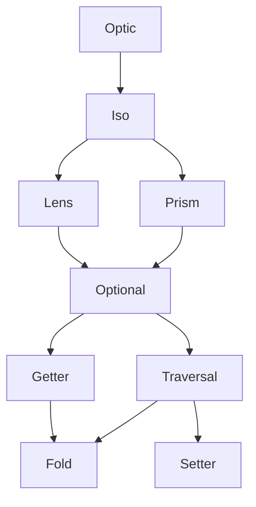

<h3 align="center">
  <a href="https://fp-ts.github.io/codec/">
    
  </a>
</h3>

<p align="center">
Access and transform immutable data
</p>

<p align="center">
  <a href="https://www.npmjs.com/package/@fp-ts/codec">
    
  </a>
</p>

# Optics



# Installation

To install the **alpha** version:

```
npm install @fp-ts/optic
```

# Documentation

- [API Reference](https://fp-ts.github.io/codec/)

# License

The MIT License (MIT)
