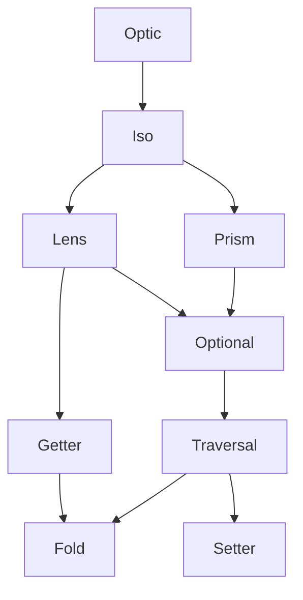

<h3 align="center">
  <a href="https://fp-ts.github.io/codec/">
    
  </a>
</h3>

<p align="center">
Access and transform immutable data
</p>

<p align="center">
  <a href="https://www.npmjs.com/package/@fp-ts/codec">
    
  </a>
</p>

# Optics



# Optic Composition Table

Almost all optics compose with the other optics. The composition of one type and itself results in the same type of optic.

|               |   Fold   |   Getter   |   Setter   |   Traversal   |   Optional   |   Prism   |   Lens    |    Iso    |
| ------------- | :------: | :--------: | :--------: | :-----------: | :----------: | :-------: | :-------: | :-------: |
| **Fold**      | **Fold** |    Fold    |    Fold    |     Fold      |     Fold     |   Fold    |   Fold    |   Fold    |
| **Getter**    |   Fold   | **Getter** |     -      |     Fold      |     Fold     |   Fold    |  Getter   |  Getter   |
| **Setter**    |    -     |     -      | **Setter** |    Setter     |    Setter    |  Setter   |  Setter   |  Setter   |
| **Traversal** |   Fold   |    Fold    |   Setter   | **Traversal** |  Traversal   | Traversal | Traversal | Traversal |
| **Optional**  |   Fold   |    Fold    |   Setter   |   Traversal   | **Optional** | Optional  | Optional  | Optional  |
| **Prism**     |   Fold   |    Fold    |   Setter   |   Traversal   |   Optional   | **Prism** | Optional  |   Prism   |
| **Lens**      |   Fold   |   Getter   |   Setter   |   Traversal   |   Optional   | Optional  | **Lens**  |   Lens    |
| **Iso**       |   Fold   |   Getter   |   Setter   |   Traversal   |   Optional   |   Prism   |   Lens    |  **Iso**  |

# Installation

To install the **alpha** version:

```
npm install @fp-ts/optic
```

# Documentation

- [API Reference](https://fp-ts.github.io/codec/)

# License

The MIT License (MIT)
