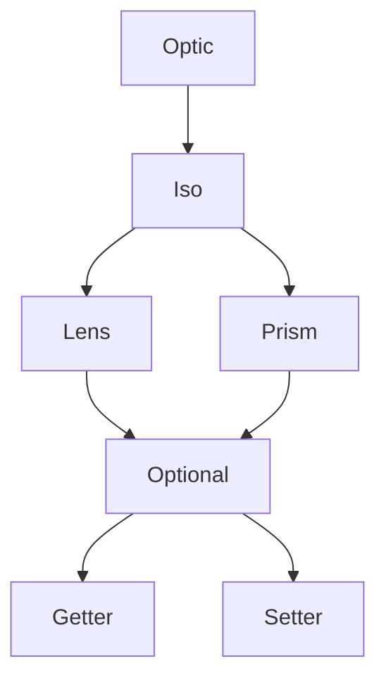

<h3 align="center">
  <a href="https://fp-ts.github.io/codec/">
    
  </a>
</h3>

<p align="center">
Access and transform immutable data
</p>

<p align="center">
  <a href="https://www.npmjs.com/package/@fp-ts/codec">
    
  </a>
</p>

# Optics



# Example

```ts
import * as Optic from "@fp-ts/optic";

interface Street {
  num: number;
  name: string;
}
interface Address {
  city: string;
  street: Street;
}
interface Company {
  name: string;
  address: Address;
}
interface Employee {
  name: string;
  company: Company;
}

const employee: Employee = {
  name: "john",
  company: {
    name: "awesome inc",
    address: {
      city: "london",
      street: {
        num: 23,
        name: "high street",
      },
    },
  },
};

const capitalize = (s: string): string =>
  s.substring(0, 1).toUpperCase() + s.substring(1);

const employeeCapitalized = {
  ...employee,
  company: {
    ...employee.company,
    address: {
      ...employee.company.address,
      street: {
        ...employee.company.address.street,
        name: capitalize(employee.company.address.street.name),
      },
    },
  },
};

const name = Optic.id<Employee>()
  .compose(Optic.field("company"))
  .compose(Optic.field("address"))
  .compose(Optic.field("street"))
  .compose(Optic.field("name"));

const capitalizeName = Optic.modify(name)(capitalize);

expect(capitalizeName(employee)).toEqual(employeeCapitalized);

const name2 = Optic.id<Employee>().compose(
  Optic.path("company", "address", "street", "name")
);

const capitalizeName2 = Optic.modify(name2)(capitalize);

expect(capitalizeName2(employee)).toEqual(employeeCapitalized);
```

# Installation

To install the **alpha** version:

```
npm install @fp-ts/optic
```

# Documentation

- [API Reference](https://fp-ts.github.io/codec/)

# License

The MIT License (MIT)
